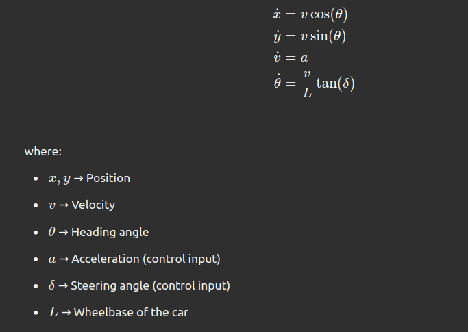
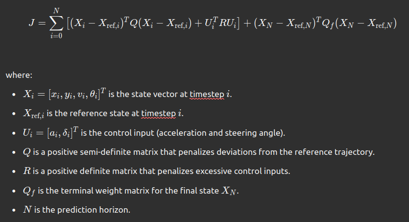

# Model Predictive Control (MPC) for ROS 2

## 📌 Overview
This repository implements a **Model Predictive Controller (MPC)** for an **F1TENTH autonomous car** using **ROS 2 (Humble)**. The controller optimizes acceleration and steering to follow a reference trajectory while considering vehicle dynamics.

The ALgo uses:
- **CasADi** for solving the MPC optimization problem
- **ROS 2** for communication with the F1TENTH car
- **ackermann-msgs** for sending drive commands

## Requirements
- Python 3.x
- Required packages: `CasADi`, `ackermann-msgs`

## 🛠 Installation
Ensure you have **ROS 2 Humble** installed. Then, install required dependencies:

```bash
pip install casadi numpy matplotlib
sudo apt install ros-humble-ackermann-msgs
```

or you can use the requirements file:

   ```bash
   pip install -r requirements.txt
   ```

## 📂 Repository Structure
```
mpc_controller/
│ 
│── src/
│   ├── mpc_controller.py    
│   ├── utils.py
│      
│── launch/
│   ├── mpc_controller.launch.py
│── requirements.txt
│
│── README.md                
```

## 📖 Mathematical Model
### 🚗 **Bicycle Model**
The vehicle dynamics are modeled using the **kinematic bicycle model**:




### 🎯 **MPC Optimization Problem**
MPC minimizes the cost function:



subject to vehicle dynamics constraints.

## Running the Controller
1️⃣ **Launch the F1TENTH simulator:**
```bash
ros2 launch f1tenth_simulator simulator.launch.py
```

2️⃣ **Run the MPC controller:**
```bash
python3 src/mpc_controller.py
```

## 📌 Future Improvements
- [ ] Implement obstacle avoidance
- [ ] Improve real-time performance
- [ ] Test on a physical F1TENTH car

## 📜 License
This project is open-source under the **MIT License**.

---
For questions, contact **Mohammed Azab** 🚀.


